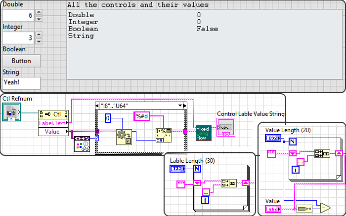

# LabVIEW Controls' Label and Value As String
Create a fixed length string from the Controls' label and values. Which can be save to a text file. 
The text file can be used to track the experimental condition and the 
used parameters. The essential part of the results and the code from 
the block diagram is shown blow. 

